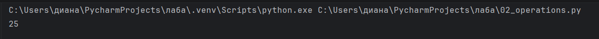

# Отчет
# Задание 1
## Описание задачи
### -Дан словарь sites с списком городов
### -Надо составить словарь словарей расстояний между ними
### -расстояние на координатной сетке вычисляется по формуле:
$((x1 - x2) ** 2 + (y1 - y2) ** 2) ** 0.5 $ 

## Решение
````python
sites = {
    'Moscow': (550, 370),
    'London': (510, 510),
    'Paris': (480, 480),
}
distances = {}
moscow_london = round(((sites['Moscow'][0] - sites['London'][0])**2 + (sites['Moscow'][1] - sites['London'][1])**2) ** 0.5,2)
moscow_paris = round(((sites['Moscow'][0] - sites['Paris'][0])**2 + (sites['Moscow'][1] - sites['Paris'][1])**2) ** 0.5,2)

london_moscow = round(((sites['London'][0] - sites['Moscow'][0])**2 + (sites['London'][1] - sites['Moscow'][1])**2) ** 0.5,2)
london_paris = round(((sites['London'][0] - sites['Paris'][0])**2 + (sites['London'][1] - sites['Paris'][1])**2) ** 0.5,2)

paris_moscow = round(((sites['Paris'][0] - sites['Moscow'][0])**2 + (sites['Paris'][1] - sites['Moscow'][1])**2) ** 0.5,2)
paris_london = round(((sites['Paris'][0] - sites['London'][0])**2 + (sites['Paris'][1] - sites['London'][1])**2) ** 0.5,2)

distances['Moscow'] = {
    'London' : moscow_london,
    'Paris'  : moscow_paris,
}
distances['London'] = {
    'Moscow' : london_moscow,
    'Paris'  : london_paris,
}
distances['Paris'] = {
    'Moscow' : paris_moscow,
    'London'  : paris_london,
}
print(distances)
````
# Скриншот работы программы:


# Задание 2
## Описание задачи
### -Есть значение радиуса круга
$ radius = 42 $
### -Надо вывести на консоль значение прощади этого круга с точностю до 4-х знаков после запятой
#### Формула вычисления площади:
$ S= π ∗ R^2 $
### Даны координаты двух точек:
```` python
point_1 = (23, 34)
point_2 = (30, 30)
````
### Для каждой точки определить, лежит ли она внутри круга, и вывести на консоль True или False. Расстояние от точки до центра круга вычисляется по формуле:
$ d=√(x²+ y²) $
### Точка лежит внутри круга, если d ≤ R.

## Решение:
```` python
radius = 42
pi = 3.1415926
square = pi * radius * radius
print(round(square,4))

point_1 = (23, 34)
distance1 = (point_1[0] ** 2 + point_1[1] ** 2) ** 0.5
print(distance1 <= radius)

point_2 = (30, 30)
distance2 = (point_2[0] ** 2 + point_2[1] ** 2) ** 0.5
print(distance2 <= radius)
````
## Скриншот работы программы:


# Задание 3
## Описание задачи:
### Расставить знаки операций "плюс", "минус", "умножение" и скобки между числами "1 2 3 4 5" так, что бы получилось число "25".
## Условия:
### -Использовать нужно только указанные знаки операций, но не обязательно все перечесленные.
### -Порядок чисел нужно сохранить.

## Решение:
```` python
result = 1 * (2 + 3) * 4 + 5
print(result)
````
## Скриншот работы программы:


# Задание 4
## Описание задачи:
### Есть строка с перечислением фильмов
```` python
my_favorite_movies = 'Терминатор, Пятый элемент, Аватар, Чужие, Назад в будущее'
````
### Вывести на консоль с помощью индексации строки, последовательно:
#####   1.первый фильм
#####   2.последний
#####   3.второй
#####   4.второй с конца
## Условия:
### -Запятая не должна выводиться.  Переопределять my_favorite_movies нельзя
### -Использовать .split() или .find()или другие методы строки нельзя - пользуйтесь только срезами, как указано в задании!

## Решение:
```` python
my_favorite_movies = 'Терминатор, Пятый элемент, Аватар, Чужие, Назад в будущее'
print(my_favorite_movies[:10])
print(my_favorite_movies[-15:])
print(my_favorite_movies[12:25])
print(my_favorite_movies[-22:-17])
````
## Скриншот работы программы:


# Задание 5
## Описание задачи:
### Создать списки:
#### 1.моя семья (минимум 3 элемента)
```` python
my_family = []
````
#### 2.список списков приблизителного роста членов вашей семьи
```` python
my_family_height = [
    # ['имя', рост],
    [],
]
````
### Вывести на консоль рост отца в формате:
####   Рост отца - ХХ см
### Вывести на консоль общий рост вашей семьи как сумму ростов всех членов:
####   Общий рост моей семьи - ХХ см

## Решение:
````python
my_family = ['Венера', 'Александр', 'Диана', 'Милана', 'Галина']
my_family_height = [
    ['Венера', 163],
    ['Александр', 170],
    ['Диана', 165],
    ['Милана',145],
    ['Галина', 164]
]
print(f'Рост отца - {my_family_height[1][1]} см')
total_height = 0
for people in my_family_height:
    total_height += people[1]
print(f'Общий рост моей семьи - {total_height} см')
````
## Скриншот работы программы:

