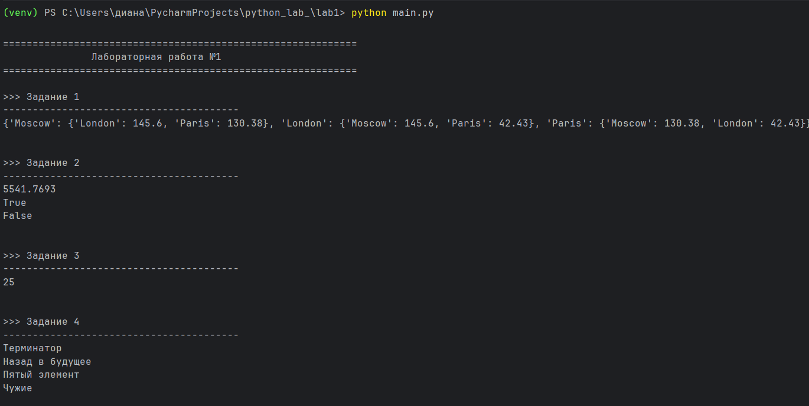
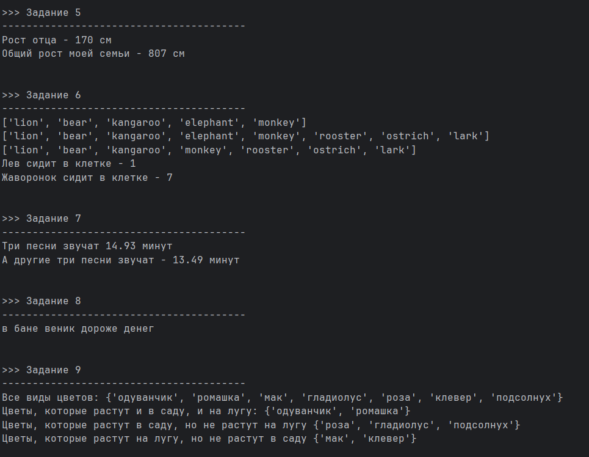
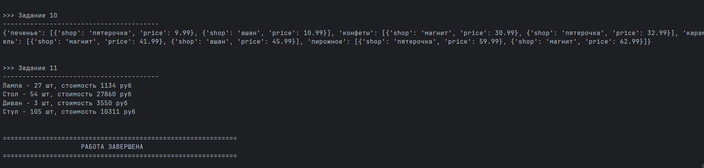

# Отчёт по уровню Medium
# Задание:
## Написать верхнеуровневый модуль, который будет использовать логику из модулей-заданий. Перед этим нужно будет придумать способ инкапсулировать логику для корректного импортирования.
# Решение:
## Создан главный модуль main.py, который последовательно запускает все 11 заданий, используя модуль `subprocess` для выполнения каждого файла-задания в отдельном процессе.
```` python
import subprocess
import sys
def main():
    #главная функция, которая выполняет все задания последовательно

    #оформление
    print('\n' + '='*60)
    print(' '* 15 + 'Лабораторная работа №1')
    print('='*60)

    #список заданий - структура данных для хранения информации о каждом задании
    #каждый элемент - это кортеж (название_задания, имя_файла)
    task_files = [
        ("Задание 1", "00_distance.py"),
        ("Задание 2", "01_circle.py"),
        ("Задание 3", "02_operations.py"),
        ("Задание 4", "03_favorite_movies.py"),
        ("Задание 5", "04_my_family.py"),
        ("Задание 6", "05_zoo.py"),
        ("Задание 7", "06_songs_list.py"),
        ("Задание 8", "07_secret.py"),
        ("Задание 9", "08_garden.py"),
        ("Задание 10", "09_shopping.py"),
        ("Задание 11", "10_store.py"),
    ]
    #цикл for - перебирает каждое задание из списка
    #переменные task_name и filename получают значения из каждого кортежа
    for task_name, filename in task_files:
        #информация о текущем задании
        print(f'\n>>> {task_name}')
        print('-'*40)
        try:
            result = subprocess.run(   #запускает внешнюю программу
                [sys.executable, filename],  #sys.executable - путь к интерпретатору Python, filename - имя файла с заданием
                capture_output=True,  #захватываем вывод программы
                text=True,  #вывод в виде текста
            )
            print(result.stdout) #stdout - стандартный вывод (то, что видим на экране)

            #если были ошибки:
            if result.stderr:  #stderr - стандартный вывод ошибок
                print(f"Ошибки: {result.stderr}")
        except FileNotFoundError:
            #обработка ошибки: файл не найден
            print(f"Файл {filename} не найден! Проверьте имя файла.")
        except Exception as e:
            #обработка любой другой ошибки
            print(f"Ошибка при запуске {filename}: {e}")
    print("\n" + "="*60)
    print(" " * 20 + "РАБОТА ЗАВЕРШЕНА")
    print("="*60 + "\n")
#условная конструкция - проверяем, запущен ли файл напрямую
#__name__ - специальная переменная Python
#если файл запущен напрямую (python main.py), то __name__ == "__main__"
#если файл импортирован как модуль (import main), то код не выполнится
if __name__ == '__main__':
    main() #вызываем главную функцию
````
# Результат выполнения программы:



# Способы запуска
```` python
#стандартный запуск
python main.py

#или с указанием полного пути
python /путь/к/main.py

#на Linux/Mac можно сделать исполняемым
chmod +x main.py
./main.py
````
# Разработанный верхнеуровневый модуль решает поставленную задачу:
1) Обеспечивает единую точку входа для всех заданий
2) Не требует модификации существующих файлов с заданиями
3) Предоставляет подробную статистику выполнения
4) Устойчив к ошибкам в отдельных заданиях
5) Легко расширяется для добавления новых заданий
# Список используемой литературы:
https://docs-python.ru/standart-library/modul-subprocess-python/

https://habr.com/ru/articles/951742/

