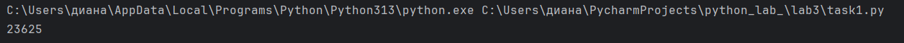
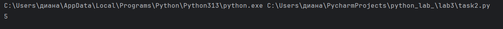
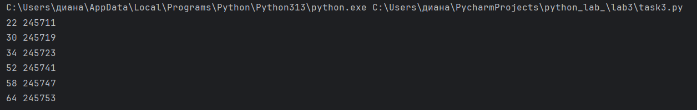

# Отчет
## Описание задачи:
### 1. Написать программу для решения задач своего варианта.
### 2.Оформить отчёт в README.md. Отчёт должен содержать:
#### 1)Условия задач
#### 2)Описание проделанной работы
#### 3)Скриншоты результатов
#### 4)Ссылки на используемые материалы
### Требования и ограничения:
#### 1.Решения задач оформить в виде функций, возвращающих ответы. Для решения первой задачи использовать itertools.

# Вариант 3
# Задача 1.
# Условие:
## Андрей составляет 6-буквенные коды из букв А, Н, Д, Р, Е, Й. Буква Й может использоваться в коде не более одного раза, при этом она не может стоять на первом месте, на последнем месте и рядом с буквой Е. Все остальные буквы могут встречаться произвольное количество раз или не встречаться совсем. Сколько различных кодов может составить Андрей?
# Описание проделанной работы:
## Для решения задачи был использован модуль itertools.product, который позволяет сгенерировать все возможные комбинации длиной 6 из заданного множества символов. 
## Каждая полученная комбинация проверялась на соответствие указанным требованиям. Если код не содержал букву «Й», он автоматически признавался допустимым. 
## В противном случае определялась позиция буквы «Й» и выполнялась проверка её местоположения и соседних символов на наличие буквы «Е». Коды, не прошедшие хотя бы одну из проверок, отбрасывались.
## Решение:
````python
from itertools import product
def count_codes():
    letters = ('А', 'Н', 'Д', 'Р', 'Е','Й')
    valid_count = 0
    for code in product(letters, repeat =  6):
        if code.count('Й') > 1:
            continue
        if 'Й' not in code:
            valid_count += 1
            continue
        y_index = code.index('Й')
        if y_index == 0:
            continue
        if y_index == 5:
            continue
        if y_index > 0 and code[y_index - 1] == 'Е':
            continue
        if y_index < 5 and code[y_index + 1] == 'Е':
            continue
        valid_count += 1
    return valid_count
result = count_codes()
print(result)
````
# Результат выполнения программы:


# Задача 2
# Условие:
## Сколько единиц содержится в двоичной записи значения выражения `8^{2020} + 4^{2017} + 26 − 1`?
# Описание проделанной работы:
## Для реализации был написан код, в котором сначала вычисляется значение выражения с использованием встроенных средств Python, позволяющих работать с целыми числами произвольной величины. 
## Затем с помощью функции `bin()` полученное число преобразуется в двоичную строку, от которой отбрасывается префикс '0b', указывающий на систему счисления. 
## После этого с использованием метода `count('1')` подсчитывается количество единиц в двоичной записи числа.
## Решение:
````python
def count():
    value = 8**2020 + 4**2017 + 26 - 1
    binary = bin(value)[2:]
    ones_count = binary.count('1')
    return ones_count
result = count()
print(result)
````
# Результат выполнения программы:


# Задача 3
# Условие:
## Найдите среди целых чисел, принадлежащих числовому отрезку [245690;245756] простые числа. 
## Выведите на экран все найденные простые числа в порядке возрастания, слева от каждого числа выведите его порядковый номер в последовательности. Каждая пара чисел должна быть выведена в отдельной строке. 
## Например, в диапазоне [5;9] ровно два различных натуральных простых числа — это числа 5 и 7, поэтому для этого диапазона вывод на экран должен содержать следующие значения:
```` python
1 5
3 7
````
# Описание проделанной работы:
## Для решения задачи был разработан алгоритм проверки числа на простоту: если число меньше 2, оно не простое; если число равно 2, оно простое; если число четное и больше 2, оно не простое; 
## для всех остальных чисел проверяется отсутствие делителей среди нечетных чисел от 3 до квадратного корня из данного числа. 
## Порядковый номер числа в последовательности вычислялся по формуле: число минус 245689, что соответствует номеру элемента в диапазоне от 1 до 67.
## Решение:
```` python
def is_prime(n):
    # Проверка, является ли число простым
    if n < 2:
        return False
    if n == 2:
        return True
    if n % 2 == 0:
        return False
    for i in range(3, int(n ** 0.5) + 1, 2):
        if n % i == 0:
            return False
    return True


def get_prime_numbers_with_orders(start, end):
# Возвращает строку с простыми числами и их порядковыми номерами
    result_lines = []

    for num in range(start, end + 1):
        if is_prime(num):
            order = num - start + 1
            result_lines.append(f"{order} {num}")

    return "\n".join(result_lines)

result = get_prime_numbers_with_orders(245690, 245756)
print(result)
````
# Результат выполнения программы:


# Список используемой литературы:
1. [Itertools в Python - Хабр](https://habr.com/ru/companies/otus/articles/529356/)
2. [itertools — Functions creating iterators for efficient looping](https://docs.python.org/3/library/itertools.html)
3. [Итерируем правильно: 20 приемов использования в Python модуля itertools](https://proglib.io/p/iteriruemsya-pravilno-20-priemov-ispolzovaniya-v-python-modulya-itertools-2020-01-03)