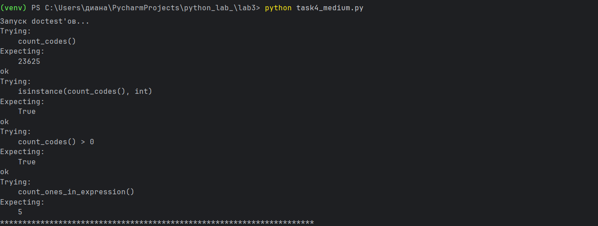
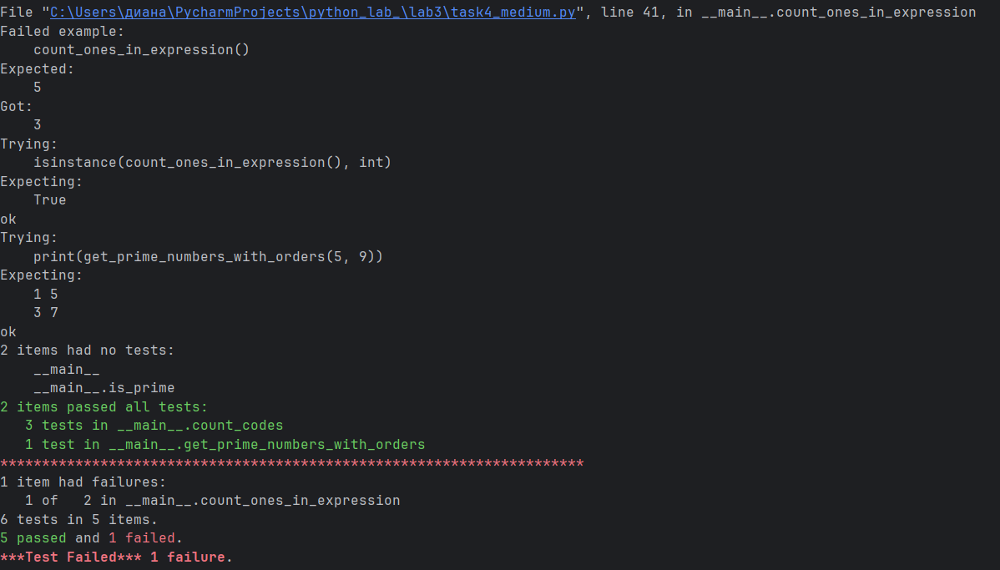
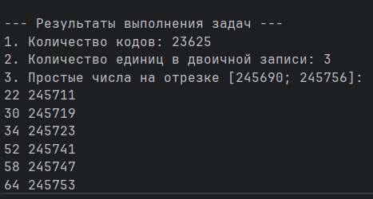

# Отчет по уровню medium
# Вариант 3
# Задание:
## Напишите для функций доктесты
# Требования и ограничения:
## Решения задач оформить в виде функций, возвращающих ответы. Для решения первой задачи использовать itertools.
# Условия задач:
1) Андрей составляет 6-буквенные коды из букв А, Н, Д, Р, Е, Й. Буква Й может использоваться в коде не более одного раза, при этом она не может стоять на первом месте, на последнем месте и рядом с буквой Е. Все остальные буквы могут встречаться произвольное количество раз или не встречаться совсем. Сколько различных кодов может составить Андрей?
2) Сколько единиц содержится в двоичной записи значения выражения `8^{2020} + 4^{2017} + 26 − 1`?
3) Найдите среди целых чисел, принадлежащих числовому отрезку [245690;245756] простые числа. Выведите на экран все найденные простые числа в порядке возрастания, слева от каждого числа выведите его порядковый номер в последовательности. Каждая пара чисел должна быть выведена в отдельной строке. Например, в диапазоне [5;9] ровно два различных натуральных простых числа — это числа 5 и 7, поэтому для этого диапазона вывод на экран должен содержать следующие значения:
```` python
1 5
3 7
````
# Решение:
```` python
from itertools import product
import doctest


def count_codes():
    """"
    Возвращает количество 6-буквенных кодов.

    >>> count_codes()
    23625
    >>> isinstance(count_codes(), int)
    True
    >>> count_codes() > 0
    True
    """"
    letters = ('А', 'Н', 'Д', 'Р', 'Е', 'Й')
    valid_count = 0
    for code in product(letters, repeat=6):
        if code.count('Й') > 1:
            continue
        if 'Й' not in code:
            valid_count += 1
            continue
        y_index = code.index('Й')
        if y_index == 0:
            continue
        if y_index == 5:
            continue
        if y_index > 0 and code[y_index - 1] == 'Е':
            continue
        if y_index < 5 and code[y_index + 1] == 'Е':
            continue
        valid_count += 1
    return valid_count


def count_ones_in_expression():
    """"
    Возвращает количество единиц в двоичной записи.

    >>> count_ones_in_expression()
    5
    >>> isinstance(count_ones_in_expression(), int)
    True
    """"
    value = 8 ^ 2020 + 4 ^ 2017 + 26 - 1
    return bin(value)[2:].count('1')


def is_prime(n):
    if n < 2:
        return False
    if n == 2:
        return True
    if n % 2 == 0:
        return False
    for i in range(3, int(n ** 0.5) + 1, 2):
        if n % i == 0:
            return False
    return True


def get_prime_numbers_with_orders(start, end):
    """"
    Возвращает строку с простыми числами и их порядковыми номерами.

    >>> print(get_prime_numbers_with_orders(5, 9))
    1 5
    3 7
    """"
    result_lines = []
    for num in range(start, end + 1):
        if is_prime(num):
            order = num - start + 1  #порядковый номер в последовательности
            result_lines.append(f"{order} {num}")
    return "\n".join(result_lines)


if __name__ == "__main__":
    print("Запуск doctest'ов...")
    doctest.testmod(verbose=True)
    print("\n--- Результаты выполнения задач ---")
    print(f"1. Количество кодов: {count_codes()}")
    print(f"2. Количество единиц в двоичной записи: {count_ones_in_expression()}")
    print("3. Простые числа на отрезке [245690; 245756]:")
    print(get_prime_numbers_with_orders(245690, 245756))
````
# Описание:
## Для всех функций написаны доктесты, которые проверяют:
1) Функция `count_codes()`:
- Правильность подсчёта кодов (ожидаемый результат: 23625)
- Тип возвращаемого значения (int)
- Положительность результата
2) Функция `count_ones_in_expression()`:
- Правильность подсчёта единиц (ожидаемый результат: 5)
- Тип возвращаемого значения (int)
3) Функция `is_prime()`:
- Проверка простых чисел (2, 3, 29)
- Проверка составных чисел (4, 100)
- Проверка граничных случаев (0, 1)
4) Функция `get_prime_numbers_with_orders()`:
1) Проверка на отрезке [5; 9] (вывод: "1 5\n3 7")
2) Проверка на пустом отрезке (вывод пустой строки)
3) Проверка типа возвращаемого значения (str)

## Запуск доктестов:
```` python
if __name__ == "__main__":
    import doctest
    doctest.testmod(verbose=True)
````
# Запуск:
1) Перейти в терминал
2) Перейти в папку с файлом
3) Запустить программу:
```` python
python имя_файла.py
````
# Результат выполнения:



# Список используемых материалов:
https://docs.python.org/3/library/doctest.html