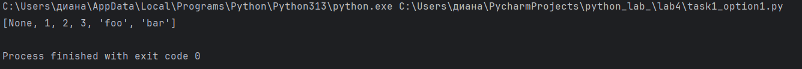
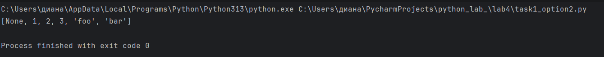
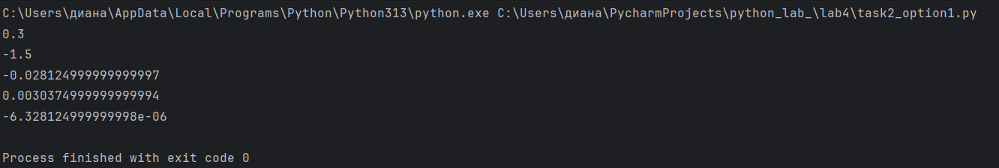
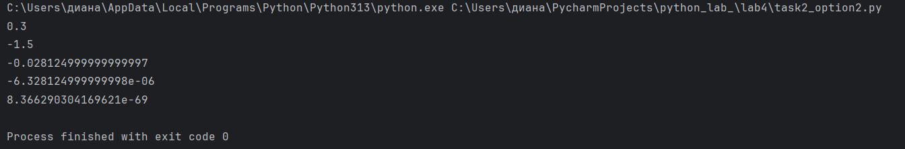

# Отчет
# Вариант 3
# Задание:
## Написать две функции для решения задач своего варианта - с использованием рекурсии и без.
# Требования и ограничения:
## Не использовать глобальные переменные и прочие средства хранения состояния между вызовами.
# Условие задачи 1:
## Функция для распаковки списка, содержащего другие объекты `(int, str, list, tuple, dict, set)` произвольной вложенности.
```` python
>>> unpack([None, [1, ({2, 3}, {'foo': 'bar'})]])
[None, 1, 2, 3, 'foo', 'bar']
````
# Решение с рекурсией:
```` python
def unpack_recursive(data):
    result = []
    for item in data:
        if isinstance(item,(list,tuple,set)):
            result.extend(unpack_recursive(item))
        elif isinstance(item,dict):
            result.extend(unpack_recursive(item.keys()))
            result.extend(unpack_recursive(item.values()))
        else:
            result.append(item)
    return result
data = [None, [1, ({2, 3}, {'foo': 'bar'})]]
print(unpack_recursive(data))
````
# Описание проделанной работы:
1. Функция принимает на вход данные любой структуры и создает пустой список result для накопления результатов.
2. В цикле for перебираются все элементы входных данных.
3. Для каждого элемента выполняется проверка его типа с помощью функции isinstance():
* Если элемент является списком (list), кортежем (tuple) или множеством (set) — функция рекурсивно вызывает саму себя для этого элемента, а полученный результат добавляется в result методом extend().
* Если элемент является словарем (dict) — рекурсивно обрабатываются сначала ключи словаря (через метод keys()), затем значения (через метод values()), после чего оба результата добавляются в result.
* Если элемент является простым типом (int, str, float, None, bool и т.д.) — элемент добавляется в result методом append().
4. После завершения цикла функция возвращает итоговый плоский список.

# Результат:


# Решение без рекурсии:
```` python
def unpuck_interative(data):
    result = []
    stack = [data]
    while stack:
        current = stack.pop()
        if isinstance(current, (list, tuple, set)):
            for item in reversed(list(current)):
                stack.append(item)
        elif isinstance(current, dict):
            for value in reversed(list(current.values())):
                stack.append(value)
            for key in reversed(list(current.keys())):
                stack.append(key)
        else:
            result.append(current)
    return list(result)
data = [None, [1, ({2, 3}, {'foo': 'bar'})]]
print(unpuck_interative(data))
````
# Описание проделанной работы:
1. В цикле while stack: (пока стек не пуст) выполняются следующие действия:
2. Из стека извлекается последний элемент методом pop() (принцип LIFO — Last In, First Out).
3. Проверяется тип извлеченного элемента:
* Если это список, кортеж или множество — все его элементы в обратном порядке (с помощью reversed()) помещаются обратно в стек для последующей обработки. Использование обратного порядка необходимо для сохранения исходной последовательности элементов.
* Если это словарь — в стек помещаются сначала его значения (в обратном порядке), затем ключи (тоже в обратном порядке). Такой порядок обусловлен принципом работы стека: последние положенные элементы обрабатываются первыми. 
* Если это простой элемент — он добавляется в список result.
4. После опустошения стека полученный результат переворачивается методом reversed() и возвращается, чтобы восстановить исходный порядок элементов.

# Результат работы:


# Условие задачи 2:
## Функция для расчёта 
$ ( w_i = w_{i-1} \cdot w_{i-2} \cdot \frac{(i-1)^2}{(i+1)^3} ) $
## с начальными условиями:
$ ( w_1 = 0.3, w_2 = -1.5 ). $

# Решение с рекурсией: 
```` python
def sequence_recursive(i):
    if i == 1:
        return 0.3
    if i == 2:
        return -1.5
    w_prev1 = sequence_recursive(i-1)
    w_prev2 = sequence_recursive(i-2)
    multiplier = ((i - 1)**2) / ((i + 1)**3)
    resilt = w_prev1 * w_prev2 * multiplier
    return resilt
print(sequence_recursive(1))
print(sequence_recursive(2))
print(sequence_recursive(3))
print(sequence_recursive(4))
print(sequence_recursive(5))
````
# Описание пррделанной работы: 
1. Функция принимает целое число i — номер искомого члена последовательности.
2. Проверяются базовые случаи:
* Если i == 1, функция возвращает 0.3
* Если i == 2, функция возвращает -1.5
3. Для i ≥ 3 выполняется рекурсивный случай:
* Рекурсивно вычисляется предыдущий член: w_prev1 = sequence_recursive(i - 1)
* Рекурсивно вычисляется предпредыдущий член: w_prev2 = sequence_recursive(i - 2)
* Вычисляется множитель по формуле: multiplier = ((i - 1) ** 2) / ((i + 1) ** 3)
* Результат вычисляется как произведение: w_prev1 * w_prev2 * multiplier
4. Полученное значение возвращается вызывающему коду.

# Результат выполнения:


# Решение без рекурсии:
```` python
def sequence_recursive(i):
    if i == 1:
        return 0.3
    if i == 2:
        return -1.5
    w_prev2 = 0.3
    w_prev1 = -1.5
    w_current = 0
    for n in range(3, i + 1):
        multiplier = ((n - 1)**2) / ((n + 1)**3)
        w_current = w_prev1 * w_prev2 * multiplier
        w_prev2 = w_prev1
        w_prev1 = w_current
    return w_current
print(sequence_recursive(1))
print(sequence_recursive(2))
print(sequence_recursive(3))
print(sequence_recursive(5))
print(sequence_recursive(10))
````
# Описание проделанной работы:
1. Функция принимает целое число i — номер искомого члена последовательности.
2. Проверяются базовые случаи:
* Если i == 1, возвращается 0.3
* Если i == 2, возвращается -1.5
3. Для i ≥ 3 выполняется итеративное вычисление:
* Создаются переменные для хранения двух последних значений:
* w_prev2 = 0.3 (w_1) — предпредыдущее значение
* w_prev1 = -1.5 (w_2) — предыдущее значение
* В цикле for n in range(3, i + 1) последовательно вычисляются все члены от w_3 до w_i:
* Вычисляется множитель для текущего n: multiplier = ((n - 1) ** 2) / ((n + 1) ** 3)
* Вычисляется текущее значение: w_current = w_prev1 * w_prev2 * multiplier
* Выполняется сдвиг окна для следующей итерации:
* w_prev2 = w_prev1 (предыдущее становится предпредыдущим)
* w_prev1 = w_current (текущее становится предыдущим)
4. После завершения цикла переменная w_current содержит искомое значение wᵢ, которое возвращается функцией.

# Результат выполнения:


# Список используемой литературы:
1. https://proglib.io/p/samouchitel-po-python-dlya-nachinayushchih-chast-13-rekursivnye-funkcii-2023-01-23
2. https://habr.com/ru/articles/337030/