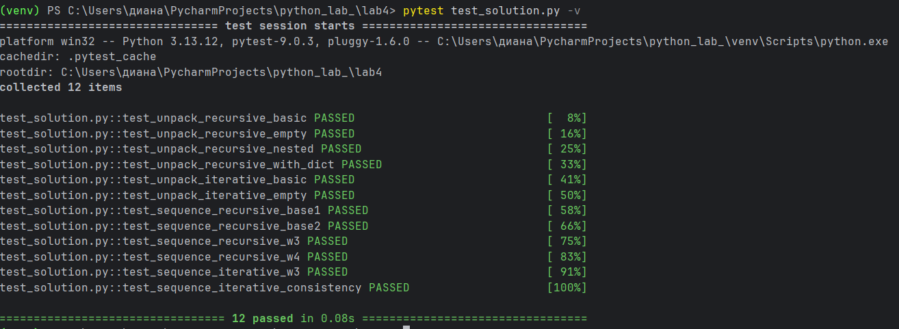

# Отчет по уровню medium
# Вариант 3
# Условие:
## Написать для своих функций тесты с помощью pytest
# Условие задачи 1:
## Функция для распаковки списка, содержащего другие объекты `(int, str, list, tuple, dict, set)` произвольной вложенности.
```` python
>>> unpack([None, [1, ({2, 3}, {'foo': 'bar'})]])
[None, 1, 2, 3, 'foo', 'bar']
````
# Условие задачи 2:
## Функция для расчёта 
$ ( w_i = w_{i-1} \cdot w_{i-2} \cdot \frac{(i-1)^2}{(i+1)^3} ) $
## с начальными условиями:
$ ( w_1 = 0.3, w_2 = -1.5 ). $
# Требования и ограничения
## Не используйте глобальные переменные и прочие средства хранения состояния между вызовами.
# Решение:
```` python
import pytest
from task1_option1 import unpack_recursive
from task1_option2 import unpack_iterative
from task2_option1 import sequence_recursive
from task2_option2 import sequence_iterative

def test_unpack_recursive_basic():
    #Проверка с примером из задания
    data = [None, [1, ({2, 3}, {'foo': 'bar'})]]
    result = unpack_recursive(data)
    assert result == [None, 1, 2, 3, 'foo', 'bar']

def test_unpack_recursive_empty():
    #Пустой список
    assert unpack_recursive([]) == []

def test_unpack_recursive_nested():
    #Глубокая вложенность
    data = [[[1, 2], [3, [4]]], 5]
    result = unpack_recursive(data)
    assert result == [1, 2, 3, 4, 5]

def test_unpack_recursive_with_dict():
    #Словарь с разными типами ключей/значений
    data = [{'a': 1, 'b': 2}, {'c': 3}]
    result = unpack_recursive(data)
    #Порядок ключей словаря не гарантирован!
    #Поэтому лучше не проверять точный порядок, а проверять множество
    assert set(result) == {'a', 'b', 'c', 1, 2, 3}

#То же самое для итеративной версии
def test_unpack_iterative_basic():
    data = [None, [1, ({2, 3}, {'foo': 'bar'})]]
    result = unpack_iterative(data)
    assert result == [None, 1, 2, 3, 'foo', 'bar']

def test_unpack_iterative_empty():
    assert unpack_iterative([]) == []


#Тесты для последовательности
def test_sequence_recursive_base1():
    assert sequence_recursive(1) == 0.3

def test_sequence_recursive_base2():
    assert sequence_recursive(2) == -1.5

def test_sequence_recursive_w3():
    #w3 = w2 * w1 * ((3-1)^2 / (3+1)^3)
    #w3 = (-1.5) * 0.3 * (4 / 64) = -0.45 * 0.0625 = -0.028125
    expected = -1.5 * 0.3 * (4 / 64)
    assert sequence_recursive(3) == pytest.approx(expected, rel=1e-9)

def test_sequence_recursive_w4():
    #w4 = w3 * w2 * ((4-1)^2 / (4+1)^3)
    w3 = -1.5 * 0.3 * (4 / 64)  # -0.028125
    expected = w3 * (-1.5) * (9 / 125)
    assert sequence_recursive(4) == pytest.approx(expected, rel=1e-9)

#Итеративная версия должна давать те же результаты
def test_sequence_iterative_w3():
    expected = -1.5 * 0.3 * (4 / 64)
    assert sequence_iterative(3) == pytest.approx(expected, rel=1e-9)

def test_sequence_iterative_consistency():
    #Рекурсивная и итеративная версии должны совпадать для первых 10 членов
    for i in range(1, 11):
        assert sequence_recursive(i) == pytest.approx(sequence_iterative(i), rel=1e-9)

````
# Описание:
## Все тесты организованы в файле `test_solution.py`. Для сравнения чисел с плавающей точкой используется `pytest.approx()` с относительной погрешностью `rel=1e-9`.
## В дополнение к обязательному примеру из задания были реализованы тесты для проверки граничных случаев:
1) Пустой список - проверяет, что функция корректно обрабатывает входные данные без элементов
2) Глубокая вложенность - проверяет работу рекурсии на структуре вида `[[[1, 2], [3, [4]]], 5]`
3) Словарь с разными типами - проверяет корректную распаковку ключей и значений словаря
## Эти тесты обеспечивают более надёжную проверку функций и выявляют потенциальные ошибки на граничных случаях.
# Инструкция к запуску:
## 1. Скачать `pytest`:
```` python
pip install pytest
````
## 2. Запустить через терминал:
```` python
pytest имя_файла.py -v
````
# Результат выполнения:

# Список используемых материалов:
https://habr.com/ru/articles/962364/

