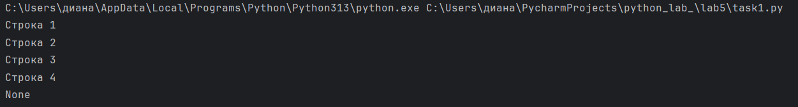
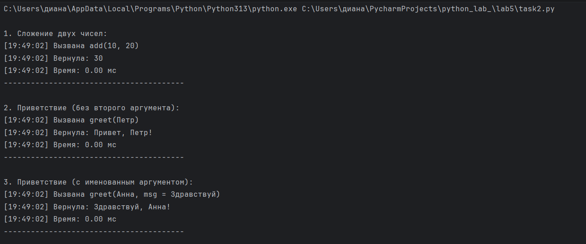

# Отчет
# Вариант 3
# Условие задачи 1:
## Замыкание для получения очередной строки из файла.
# Решение:
```` python
file = open("test.txt", "w", encoding='utf-8')
file.write("Строка 1\n")
file.write("Строка 2\n")
file.write("Строка 3\n")
file.write("Строка 4\n")
file.close()
def get_file_reader(filename):
    file = open(filename, 'r', encoding='utf-8')
    lines = file.readlines()
    file.close()
    for i in range(len(lines)):
        lines[i] = lines[i].strip('\n')
    current = 0
    def read_next():
        nonlocal current
        if current < len(lines):
            line = lines[current]
            current += 1
            return line
        else:
            return None
    return read_next
reader = get_file_reader("test.txt")
print(reader()) # Строка 1
print(reader()) # Строка 2
print(reader()) # Строка 3
print(reader()) # Строка 4
print(reader()) # None
````
# Описание проделанной работы:
1. Создание тестового файла
* Открывается файл `"test.txt"` в режиме записи `('w')`
* Используется кодировка UTF-8 для поддержки русского языка
* Записываются 4 строки, каждая с символом перевода строки `\n`
* Файл закрывается
2. Создание функции `get_file_reader(filename)`
* Функция выполняет следующие действия:
1) Чтение файла
2) Открывает файл в режиме чтения `('r')`
3) Считывает все строки методом `readlines()`
4) Закрывает файл
* Обработка строк
1) Проходит по всем строкам в цикле
2) Удаляет символ перевода строки `\n` с помощью `strip('\n')`
3) Получает чистые строки без лишних символов
* Инициализация счётчика
1) Создаёт переменную `current = 0` для отслеживания текущей позиции
* Создание внутренней функции `read_next()`
1) Использует `nonlocal current` для изменения переменной из внешней функции
2) Проверяет, не вышли ли за пределы списка
3) Если строки есть: берёт строку по индексу, увеличивает счётчик, возвращает строку
4) Если строки закончились: возвращает `None`
* Возврат замыкания
1) Возвращает внутреннюю функцию `read_next`
3. Использование замыкания
1) Вызывается `get_file_reader("test.txt")`, создаётся замыкание
2) Результат сохраняется в переменную reader
3) Вызывается `reader()` 5 раз подряд
4) Каждый вызов возвращает следующую строку или None

# Результат выполнения программы:


# Условие задачи 2:
## Декоратор, который будет логировать вызовы функций.
# Решение:
```` python
import time
def log_calls(func):
    def wrapper(*args, **kwargs):
        current_time = time.strftime('%H:%M:%S')
        args_list = [str(arg) for arg in args]
        args_list += [f'{k} = {v}' for k,v in kwargs.items()]
        args_str = ', '.join(args_list) if args_list else 'нет аргументов'
        print(f'[{current_time}] Вызвана {func.__name__}({args_str})')
        start = time.time()
        result = func(*args, **kwargs)
        end = time.time()
        print(f"[{current_time}] Вернула: {result}")
        print(f"[{current_time}] Время: {(end - start) * 1000:.2f} мс")
        print("-" * 40)
        return result
    return wrapper
@log_calls
def add(a, b):
    return a + b
@log_calls
def greet(name, msg="Привет"):
    return f"{msg}, {name}!"
if __name__ == "__main__":
    print("\n1. Сложение двух чисел:")
    add(10, 20)

    print("\n2. Приветствие (без второго аргумента):")
    greet("Петр")

    print("\n3. Приветствие (с именованным аргументом):")
    greet("Анна", msg="Здравствуй")
````
# Описание проделанной работы:
1. Импортируется модуль `time` для работы со временем
2. Создание декоратора `log_calls`
* Декоратор `log_calls` принимает функцию func в качестве аргумента и возвращает обёртку wrapper, которая добавляет логирование к исходной функции.
3. Внутренняя функция wrapper
* Функция `wrapper(*args, **kwargs)` выполняет следующие действия:
* Получение текущего времени
1) Используется `time.strftime('%H:%M:%S')` для получения времени в формате часы:минуты:секунды
2) Результат сохраняется в переменную `current_time`
* Формирование строки с аргументами
1) Создаётся пустой список `args_list`
2) В цикле перебираются позиционные аргументы args и добавляются в список в виде строк
3) В цикле перебираются именованные аргументы kwargs и добавляются в список в формате ключ = значение
4) С помощью `', '.join(args_list)` все аргументы соединяются через запятую
5) Если аргументов нет, выводится строка `"нет аргументов"`
* Логирование вызова функции
1) Выводится сообщение с временем, именем функции и переданными аргументами
2) Формат: `[время] Вызвана имя_функции(аргументы)`
* Выполнение исходной функции и замер времени
1) Запоминается время начала выполнения с помощью `time.time()`
2) Вызывается исходная функция `func(*args, **kwargs)`, результат сохраняется в `result`
3) Запоминается время окончания выполнения
4) Вычисляется разница в миллисекундах: `(end - start) * 1000`
* Логирование результата
1) Выводится сообщение с результатом выполнения функции
2) Выводится сообщение с временем выполнения в миллисекундах с двумя знаками после запятой
3) Выводится разделитель из 40 дефисов для наглядности
* Возврат результата
1) Функция возвращает `result`, который вернула исходная функция
4. Применение декоратора к функциям
* Декоратор применяется к функции add с помощью синтаксиса `@log_calls`
* Декоратор применяется к функции greet с помощью синтаксиса `@log_calls`
* Теперь при вызове этих функций автоматически выполняется логирование
5. Создаем тестрируемые функции
6. Запускаем
* В блоке `if __name__ == "__main__":` последовательно вызываются три примера:
1) Сложение двух чисел
2) Приветствие без второго аргумента
3) Приветствие с именованным аргументом
# Результат выполнения программы:



# Ссылки на используемые материалы: 
https://habr.com/ru/articles/141411/

https://habr.com/ru/articles/781866/

https://python-academy.org/ru/guide/decorators