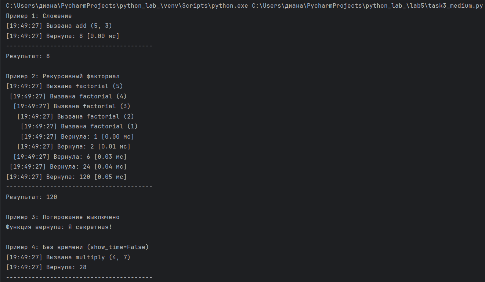
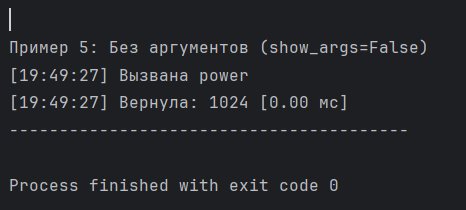

# Отчет по уровню medium
# Вариант 3
# Условие задачи 2 из уровня rare:
## Декоратор, который будет логировать вызовы функций.
# Условие уровня medium:
## Создайте декоратор с опциональным параметром. Подумайте о поддержке рекурсивных функций. 
# Решение:
```` python
import time
#внешняя функция
def log_c(logging_enabled=True, show_time=True, show_args=True):
    #- logging_enabled: включить/выключить логирование (True/False)
    #- show_time: показывать время выполнения (True/False)
    # - show_args: показывать аргументы функции (True/False)
    #средняя функция - декоратор
    def decorator(func):
        #счетчик глубины рекурсии
        recursion_depth = 0
        #внутренняя фун-ия - обертка
        def wrapper(*args, **kwargs):
            nonlocal recursion_depth
            recursion_depth += 1
            #создаем отступ для визуализации рекурсии
            indent = " " * (recursion_depth - 1)
            #логирование входа в фун-ию
            if logging_enabled:
                #если логирование включено
                current_time = time.strftime("%H:%M:%S") #включаем время
                #формируем строку с аргументами
                args_str = ""
                if show_args:
                    #проверяем, нужно ли показывать аргументы
                    args_list = []
                    #добавляем все позиционные аргументы (args)
                    for arg in args:
                        args_list.append(str(arg))
                    #добавляем все именованные аргументы (kwargs)
                    for key,value in kwargs.items():
                        args_list.append(f"{key}={value}")
                    #если список не пустой, то соединяем все эелементы через запятую
                    if args_list:
                        args_str = f'({', '.join(args_list)})'
                    else:
                        args_str = '(нет аргументов)'
                #все вместе: отступ + время + вызвана + имя функции + аргументы
                print(f"{indent}[{current_time}] Вызвана {func.__name__} {args_str}")
            #выполнение исходной функции
            #если нужно показывать время, то запоминаем время начала
            if show_time:
                start = time.time()
            else:
                start = None
            #вызываем ориг. фун-ию и именно здесь происходит рекурсивный вызов, если фун-ия рекурсивная
            result = func(*args, **kwargs)
            #если нужно показывать время, то запоминаем время окончания
            if show_time:
                end = time.time()
            else:
                end = None
            #логирование выхода из фун-ии
            if logging_enabled:
                #запоминаем время
                current_time = time.strftime("%H:%M:%S")
                #выводим результат
                if show_time and end is not None and start is not None:
                    #вычисляем время выполнения в миллисекундах
                    elapsed_ms = (end - start) * 1000
                    print(f"{indent}[{current_time}] Вернула: {result} [{elapsed_ms:.2f} мс]")
                else:
                    #eсли время показывать не нужно
                    print(f"{indent}[{current_time}] Вернула: {result}")

                #разделитель печатаем ТОЛЬКО когда вернулись из САМОГО ПЕРВОГО вызова
                #recursion_depth == 1 означает, что мы на самом верхнем уровне (не внутри рекурсии)
                if recursion_depth == 1:
                    print(f"{indent}{'-' * 40}")

            #выход из фун-ии
            #уменьшаем глубину: мы ВЫХОДИМ из функции
            recursion_depth -= 1

            #возвращаем результат исходной функции
            return result

        #обёртка wrapper готова, возвращаем её
        return wrapper

        #декоратор готов, возвращаем его
    return decorator

#ПРИМЕР 1: обычная функция с логированием

@log_c(logging_enabled=True, show_time=True, show_args=True)
def add(a, b):
    "Складывает два числа"
    return a + b

# При вызове add(5, 3):
# 1. Python видит @log_c(...) и вызывает log_c(...)
# 2. log_c возвращает decorator
# 3. decorator(add) возвращает wrapper
# 4. wrapper(5, 3) выполняется, логирует, вызывает настоящую add(5, 3)

print("Пример 1: Сложение")
result = add(5, 3)
print(f"Результат: {result}\n")

#ПРИМЕР 2: рекурсивная фун-ия

@log_c(logging_enabled=True, show_time=True, show_args=True)
def factorial(n):
    "Вычисляет факториал рекурсивно."
    "factorial(5) = 5 * 4 * 3 * 2 * 1 = 120"

    if n <= 1:
        return 1
    #рекурсивный вызов: функция вызывает сама себя
    return n * factorial(n - 1)

print("Пример 2: Рекурсивный факториал")
result = factorial(5)
print(f"Результат: {result}\n")

#ПРИМЕР 3: отключение логирования

@log_c(logging_enabled=False)
def secret_function():
    return "Я секретная!"

print("Пример 3: Логирование выключено")
result = secret_function()
print(f"Функция вернула: {result}\n")

#ПРИМЕР 4: без отображения времени

@log_c(logging_enabled=True, show_time=False, show_args=True)
def multiply(a, b):
    return a * b

print("Пример 4: Без времени (show_time=False)")
multiply(4, 7)
print()

#ПРИМЕР 5: без отображения аргументов

@log_c(logging_enabled=True, show_time=True, show_args=False)
def power(base, exp):
    return base ** exp

print("Пример 5: Без аргументов (show_args=False)")
power(2, 10)
````
# Описание проделанной работы:
## 1.Добавление опциональных параметров
### Проблема: В исходном декораторе нельзя было изменить его поведение - он всегда выводил полную информацию о вызове функции.
### Решение: Декоратор был переписан так, чтобы принимать три параметра:
1) logging_enabled ->	True (значение по умолчанию) -> Включает или отключает всё логирование целиком
2) show_time ->	True (значение по умолчанию) -> Показывает или скрывает время выполнения функции
3) show_args -> True (значение по умолчанию) -> Показывает или скрывает аргументы, переданные функции
## Как это работает технически:
### Вместо одного уровня вложенности (декоратор -> обёртка) была создана трёхуровневая структура:
```` python
def log_c(параметры):           #1-й уровень: принимает параметры
    def decorator(func):        #2-й уровень: принимает функцию
        def wrapper(...):       #3-й уровень: обёртка, которая выполняется при вызове
            #здесь используется параметры
        return wrapper
    return decorator
````
## Такая структура позволяет писать код в двух вариантах:
```` python
@log_c                           #без параметров (работает как раньше)
@log_c(logging_enabled=False)    #с параметрами (логирование выключено)
@log_c(show_time=False)          #без отображения времени
@log_c(show_args=False)          #без отображения аргументов
````
## 2.Был добавлен счётчик глубины рекурсии и система отступов.
### Принцип работы:
```` python
recursion_depth = 0              #счётчик глубины
def wrapper(...):
    recursion_depth += 1          #вход в функцию -> увеличиваем
    indent = "  " * (recursion_depth - 1)   # отступ = глубина × 2 пробела
    
    # ... логирование с отступом ...
    
    result = func(...)            #рекурсивный вызов
    
    recursion_depth -= 1          #выход из функции -> уменьшаем
    return result
````
## Что это даёт:
1) При первом вызове (глубина = 1) отступ отсутствует
2) При каждом вложенном вызове (глубина 2, 3, 4...) добавляется по 2 пробела
3) При выходе из функции отступ уменьшается
## 3. Дополнительные улучшения
## Разделитель после завершения:
### Разделитель из 40 дефисов выводится только после завершения корневого вызова (когда `recursion_depth == 1`). Это делает вывод более аккуратным и не загромождает его лишними разделителями внутри рекурсии.
## 4. Тестирование
### Для проверки работы декоратора были написаны тестовые примеры:
1) Сложение чисел (пример) -> Базовая работа декоратора (что проверяется) -> Корректное логирование (результат)
2) Рекурсивный факториал -> Поддержка рекурсии с отступами -> Красивый вывод с отступами
3) Отключение логирования -> Параметр `logging_enabled=False` -> Нет сообщений от декоратора
4) Без времени -> Параметр `show_time=False` -> Время не выводится
5) Без аргументов -> Параметр `show_args=False` -> Аргументы не выводятся
## 5. Итог
### В результате выполнения задачи создан гибкий и настраиваемый декоратор `log_c`, который:
- Принимает опциональные параметры для настройки поведения
- Корректно работает с рекурсивными функциями (визуализация вложенности)
- Сохраняет все функции исходного декоратора
- Может применяться к замыканию из первой задачи

# Результат работы программы:



# Список используемой литературы:
https://sky.pro/wiki/media/dekoratory-s-parametrami-v-python/
