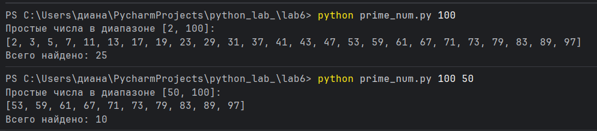

# Отчет
# Вариант 3
# Условие задачи:
## Генератор простых чисел.
# Решение:
```` python
import argparse
import sys
def sieve_of_eratosthenes(limit):
    if limit < 2:
        return []
    is_prime = [True] * (limit+1)
    is_prime[0] = is_prime[1] = False
    p = 2
    while p*p <= limit:
        if is_prime[p]:
            for i in range(p * p, limit + 1, p):
                is_prime[i] = False
        p += 1
    primes = [num for num, prime in enumerate(is_prime) if prime]
    return primes
def gererate_primes(start, end):
    if start < 2:
        start = 2
    if end < start:
        return []
    primes_up_to_end = sieve_of_eratosthenes(end)
    result = [p for p in primes_up_to_end if p >= start]
    return result
def main():
    parser = argparse.ArgumentParser(description='Генератор простых чисел')
    parser.add_argument('end', type= int, help = 'Вверхняя граница диапазона')
    parser.add_argument('start', nargs = '?', type = int, default = 2, help = 'Нижняя граница диапазона (по умолчанию 2)')
    args = parser.parse_args()
    start = args.start
    end = args.end

    if start > end:
        print(f'Ошибка: Нижняя граница ({start}) не может быть больше верхней ({end}).')
        sys.exit(1)
    primes = gererate_primes(start, end)
    if not primes:
        print(f'Простых чисел в диапазоне [{start}, {end}] не найдено.')
    else:
        print(f'Простые числа в диапазоне [{start}, {end}]:')
        print(primes)
        print(f'Всего найдено: {len(primes)}')
if __name__ == '__main__':
    main()
````
# Описание проделанной работы:
## 1.Используем библиотеки: 
1. `argparse` — для обработки аргументов командной строки
2. `sys` — для завершения программы при ошибках
## Алгоритм: Решето Эратосфена
## 2. Структура программы
## Программа состоит из трех основных функций:

## 2.1. Функция `sieve_of_eratosthenes(limit)`
### Назначение: Находит все простые числа до заданного предела
### Алгоритм:
1. Создает список логических значений размером `limit+1`, где все элементы изначально True
2. Помечает 0 и 1 как False (не простые числа)
3. Начиная с 2, для каждого числа p, если оно простое, помечает все его кратные как False
4. Оптимизация: цикл выполняется только пока p*p <= limit
5. Возвращает список чисел, оставшихся True

## 2.2. Функция `generate_primes(start, end)`
### Назначение: Генерирует простые числа в заданном диапазоне
### Алгоритм:
1. Корректирует нижнюю границу: если start < 2, устанавливает start = 2
2. Проверяет корректность диапазона: если end < start, возвращает пустой список
3. Вызывает `sieve_of_eratosthenes(end)` для получения всех простых чисел до end
4. Фильтрует список, оставляя числа >= start
5. Возвращает отфильтрованный список

## 2.3. Функция `main()`
### Назначение: Управляет работой программы и обрабатывает пользовательский ввод
### Алгоритм:
1. Создает парсер аргументов командной строки
2. Добавляет аргументы:
   - `end` — обязательный аргумент (верхняя граница)
   - `start` — необязательный аргумент (нижняя граница, по умолчанию 2)
3. Проверяет корректность диапазона
4. Вызывает `generate_primes()` для получения списка простых чисел
5. Выводит результат или сообщение об ошибке

## 3. Пример для правильного запуска программы:
## Из командной строки:
# Переход в папку с программой
`cd C:\Users\диана\PycharmProjects\python_lab_\lab6`
# Только верхняя граница (от 2 до 100)
`python prime_num.py 100`
# Полный диапазон (от 50 до 100)
`python prime_num.py 100 50`
# Получение справки
`python prime_num.py -h`
# Скриншот результата:

# Ссылки на используемые материалы:
https://docs-python.ru/standart-library/modul-argparse-python/

https://ru.wikipedia.org/wiki/Решето_Эратосфена