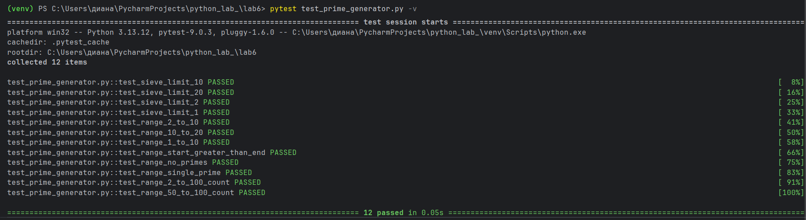

# Отчет по уровню medium
# Вариант 3
# Условие задачи:
## Генератор простых чисел.
# Условие для сложности medium:
## Напишите для генератора тесты с помощью pytest
# Решение:
```` python
# Импортируем функции из программы
from prime_num import generate_primes, sieve_of_eratosthenes

def test_sieve_limit_10():
    "Тест 1: простые числа до 10"
    result = sieve_of_eratosthenes(10)
    expected = [2, 3, 5, 7]
    assert result == expected


def test_sieve_limit_20():
    "Тест 2: простые числа до 20"
    result = sieve_of_eratosthenes(20)
    expected = [2, 3, 5, 7, 11, 13, 17, 19]
    assert result == expected


def test_sieve_limit_2():
    "Тест 3: минимальная граница"
    result = sieve_of_eratosthenes(2)
    expected = [2]
    assert result == expected


def test_sieve_limit_1():
    "Тест 4: если limit=1, нет простых чисел"
    result = sieve_of_eratosthenes(1)
    expected = []
    assert result == expected


def test_range_2_to_10():
    "Тест 5: диапазон [2, 10]"
    result = generate_primes(2, 10)
    expected = [2, 3, 5, 7]
    assert result == expected


def test_range_10_to_20():
    "Тест 6: диапазон [10, 20]"
    result = generate_primes(10, 20)
    expected = [11, 13, 17, 19]
    assert result == expected


def test_range_1_to_10():
    "Тест 7: start меньше 2 (должен исправиться на 2)"
    result = generate_primes(1, 10)
    expected = [2, 3, 5, 7]
    assert result == expected


def test_range_start_greater_than_end():
    "Тест 8: start > end (пустой результат)"
    result = generate_primes(10, 5)
    expected = []
    assert result == expected


def test_range_no_primes():
    "Тест 9: диапазон без простых чисел"
    result = generate_primes(20, 22)
    expected = []  # 20,21,22 - нет простых
    assert result == expected


def test_range_single_prime():
    "Тест 10: диапазон с одним простым числом"
    result = generate_primes(13, 13)
    expected = [13]
    assert result == expected


def test_range_2_to_100_count():
    "Тест 11: проверка количества (от 2 до 100 должно быть 25 простых)"
    result = generate_primes(2, 100)
    assert len(result) == 25


def test_range_50_to_100_count():
    "Тест 12: проверка количества (от 50 до 100 должно быть 10 простых)"
    result = generate_primes(50, 100)
    assert len(result) == 10
````
# Описание проделанной работы:
##  1.Инструменты
- pytest - фреймворк для тестирования на Python
- assert - ключевое слово для проверки утверждений
## 2. Что было сделано
### 2.1. Создан файл test_prime_generator.py с тестами
### 2.2. Написаны тесты для функции sieve_of_eratosthenes (решето Эратосфена):
- Проверка простых чисел до 10
- Проверка простых чисел до 20
- Проверка минимальной границы (`limit=2`)
- Проверка отсутствия простых чисел (`limit=1`)
### 2.3. Написаны тесты для функции `generate_primes` (генератор в диапазоне):
- Проверка обычного диапазона [2, 10]
- Проверка диапазона [10, 20]
- Проверка автоматической коррекции start < 2
- Проверка некорректного диапазона (start > end)
- Проверка диапазона без простых чисел
- Проверка диапазона с одним простым числом
### 2.4. Написаны тесты для проверки количества простых чисел:
- Проверка: от 2 до 100 должно быть 25 простых чисел
- Проверка: от 50 до 100 должно быть 10 простых чисел
## 3. Как работают тесты
### 3.1. Каждая тестовая функция вызывает тестируемую функцию с заданными параметрами
### 3.2. Полученный результат сравнивается с ожидаемым через assert
### 3.3. Если результат совпадает с ожидаемым - тест проходит
### 3.4. Если результат не совпадает - тест падает и показывает ошибку
## 4. Как запускались тесты
### Выполнена команда в терминале:
```` python
pytest test_prime_generator.py -v
````
## 5. Результаты тестирования
### Все 12 тестов успешно пройдены:
1) 4 теста для решета Эратосфена
2) 6 тестов для генератора диапазонов
3) 2 теста для проверки количества простых чисел

# Результат программы: 


# Список используемой литературы:
https://habr.com/ru/articles/962364/