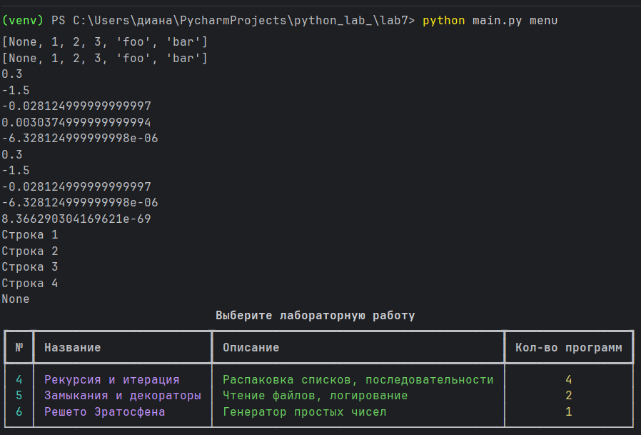
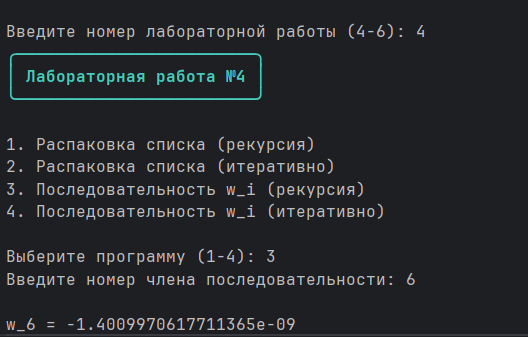

# Отчет
# Вариант 3

# Условие задач из лабораторной работы №4:
## Написать две функции для решения задач своего варианта - с использованием рекурсии и без.
# Требования и ограничения:
## Не использовать глобальные переменные и прочие средства хранения состояния между вызовами.
## Условие задачи 1:
### Функция для распаковки списка, содержащего другие объекты `(int, str, list, tuple, dict, set)` произвольной вложенности.
## Условие задачи 2:
### Функция для расчёта 
$( w_i = w_{i-1} \cdot w_{i-2} \cdot \frac{(i-1)^2}{(i+1)^3} )$
## с начальными условиями:
$( w_1 = 0.3, w_2 = -1.5 ).$

# Условие задач из лабораторной работы №5:
## Условие задачи 1:
## Замыкание для получения очередной строки из файла.
## Условие задачи 2:
## Декоратор, который будет логировать вызовы функций.

# Условие задач из лабораторной работы №6:
## Генератор простых чисел.

# Файл __init__.py ("паспорт" пакета):
```` python
"Пакет с лабораторными работами №4-6"

# Импорты из lab4
from .lab4.task1_option1 import unpack_recursive
from .lab4.task1_option2 import unpuck_interative as unpack_iterative
from .lab4.task2_option1 import sequence_recursive
from .lab4.task2_option2 import sequence_iterative

# Импорты из lab5
from .lab5.task1 import get_file_reader
from .lab5.task2 import log_c

# Импорты из lab6
from .lab6.prime_num import generate_primes

# Список того, что будет доступно
__all__ = [
    'unpack_recursive',
    'unpack_iterative',
    'sequence_recursive',
    'sequence_iterative',
    'get_file_reader',
    'log_c',
    'generate_primes'
]
````
# Файл main.py (точка входа,меню):
```` python
"Запускающий модуль для лабораторных работ №4-6"

import typer
from rich import print as rprint
from rich.table import Table
from rich.panel import Panel

from rare_package import (
    unpack_recursive, unpack_iterative,
    sequence_recursive, sequence_iterative,
    get_file_reader, log_c,
    generate_primes
)

app = typer.Typer()


#лаба 4
@app.command()
def lab4():
    """Лабораторная №4: рекурсивные и итеративные алгоритмы"""
    rprint(Panel.fit("[bold cyan]Лабораторная работа №4[/bold cyan]", border_style="cyan"))

    print("\n1. Распаковка списка (рекурсия)")
    print("2. Распаковка списка (итеративно)")
    print("3. Последовательность w_i (рекурсия)")
    print("4. Последовательность w_i (итеративно)")

    choice = input("\nВыберите программу (1-4): ")

    if choice == "1":
        data_str = input("Введите данные (пример: [None, [1, ({2, 3}, {'foo': 'bar'})]]): ")
        try:
            data = eval(data_str)
            result = unpack_recursive(data)
            print(f"\nРезультат: {result}")
        except Exception as e:
            print(f"Ошибка: {e}")

    elif choice == "2":
        data_str = input("Введите данные (пример: [None, [1, ({2, 3}, {'foo': 'bar'})]]): ")
        try:
            data = eval(data_str)
            result = unpack_iterative(data)
            print(f"\nРезультат: {result}")
        except Exception as e:
            print(f"Ошибка: {e}")

    elif choice == "3":
        try:
            i = int(input("Введите номер члена последовательности: "))
            if i <= 0:
                print("Ошибка: номер должен быть положительным")
                return
            result = sequence_recursive(i)
            print(f"\nw_{i} = {result}")
        except ValueError:
            print("Ошибка: введите целое число")
        except RecursionError:
            print("Ошибка: слишком глубокий уровень рекурсии (попробуйте меньшее число)")

    elif choice == "4":
        try:
            i = int(input("Введите номер члена последовательности: "))
            if i <= 0:
                print("Ошибка: номер должен быть положительным")
                return
            result = sequence_iterative(i)
            print(f"\nw_{i} = {result}")
        except ValueError:
            print("Ошибка: введите целое число")

    else:
        print("Ошибка: неверный выбор! Введите 1, 2, 3 или 4")


#лаба 5
@app.command()
def lab5():
    "Лабораторная №5: замыкания и декораторы"
    rprint(Panel.fit("[bold magenta]Лабораторная работа №5[/bold magenta]", border_style="magenta"))

    print("\n1. Замыкание для чтения файла")
    print("2. Декоратор для логирования")

    choice = input("\nВыберите программу (1-2): ")

    if choice == "1":
        filename = input("Введите имя файла: ")
        try:
            reader = get_file_reader(filename)
            print("\nСодержимое файла:")
            line_num = 1
            while True:
                line = reader()
                if line is None:
                    break
                print(f"  {line_num}. {line}")
                line_num += 1
            if line_num == 1:
                print("  (файл пуст)")
        except FileNotFoundError:
            print(f"Ошибка: файл '{filename}' не найден!")
        except Exception as e:
            print(f"Ошибка: {e}")

    elif choice == "2":
        @log_c
        def add(a, b):
            return a + b

        @log_c
        def greet(name, msg="Привет"):
            return f"{msg}, {name}!"

        print("\n--- Пример 1: add(10, 20) ---")
        add(10, 20)

        print("\n--- Пример 2: greet('Петр') ---")
        greet("Петр")

        print("\n--- Пример 3: greet('Анна', msg='Здравствуй') ---")
        greet("Анна", msg="Здравствуй")

    else:
        print("Ошибка: неверный выбор! Введите 1 или 2")


#лаба 6
@app.command()
def lab6():
    """Лабораторная №6: генератор простых чисел"""
    rprint(Panel.fit("[bold green]Лабораторная работа №6[/bold green]", border_style="green"))

    print("Программа: Генератор простых чисел (Решето Эратосфена)\n")

    try:
        start = int(input("Введите нижнюю границу: "))
        end = int(input("Введите верхнюю границу: "))

        if start > end:
            print(f"Ошибка: нижняя граница ({start}) больше верхней ({end})")
            return

        primes = generate_primes(start, end)

        if not primes:
            print(f"\nПростых чисел в диапазоне [{start}, {end}] не найдено")
        else:
            print(f"\nПростые числа в диапазоне [{start}, {end}]:")
            print(primes)
            print(f"\nВсего найдено: {len(primes)}")

    except ValueError:
        print("Ошибка: введите целые числа!")


#меню
@app.command()
def menu():
    """Интерактивное меню для выбора лабораторной работы"""
    table = Table(title="[bold]Выберите лабораторную работу[/bold]", title_style="bold white")
    table.add_column("№", style="cyan", justify="center")
    table.add_column("Название", style="magenta")
    table.add_column("Описание", style="green")
    table.add_column("Кол-во программ", style="yellow", justify="center")

    table.add_row("4", "Рекурсия и итерация", "Распаковка списков, последовательности", "4")
    table.add_row("5", "Замыкания и декораторы", "Чтение файлов, логирование", "2")
    table.add_row("6", "Решето Эратосфена", "Генератор простых чисел", "1")

    rprint(table)

    choice = input("\nВведите номер лабораторной работы (4-6): ")

    if choice == "4":
        lab4()
    elif choice == "5":
        lab5()
    elif choice == "6":
        lab6()
    else:
        print("Ошибка: введите 4, 5 или 6!")


#запуск
if __name__ == "__main__":
    app()
````

# Описание проделанной работы:
## 1. Создание структуры пакета
## Была создана следующая структура проекта:
``` python
lab7/
│
├── main.py                          # Запускающий модуль (Typer)
├── README.md                        # Отчёт
│
└── rare_package/                    # Пакет
    │
    ├── __init__.py                  # Инициализация пакета
    │
    ├── lab4/                        # Лабораторная №4
    │   ├── task1_option1.py         # Распаковка (рекурсия)
    │   ├── task1_option2.py         # Распаковка (итеративно)
    │   ├── task2_option1.py         # Последовательность (рекурсия)
    │   └── task2_option2.py         # Последовательность (итеративно)
    │
    ├── lab5/                        # Лабораторная №5
    │   ├── task1.py                 # Замыкание для чтения файла
    │   ├── task2.py                 # Декоратор логирования
    │   └── test.txt                 # Тестовый файл
    │
    └── lab6/                        # Лабораторная №6
        └── prime_num.py             # Решето Эратосфена
```
## 2. Файл __init__.py
### Файл __init__.py служит "паспортом" пакета. Он:
1) Сообщает Python, что папка rare_package — это пакет
2) Упрощает импорт функций (через переименование)
## Файл main.py (запускающий модуль)
### Файл main.py - это главный запускающий файл программы. Он выполняет две основные задачи:
1) объединяет все лабораторные работы в одну программу
2) предоставляет удобный интерфейс для запуска любой программы из лабораторных
## 2.1. Импорт библиотек
```python
import typer
from rich import print as rprint
from rich.table import Table
from rich.panel import Panel

from rare_package import (
    unpack_recursive, unpack_iterative,
    sequence_recursive, sequence_iterative,
    get_file_reader, log_c,
    generate_primes
)
```
## Пояснения:
1) typer — библиотека для создания команд в терминале
2) rich — библиотека для красивого цветного вывода
3) rprint — переименованная функция print из rich (для цветного вывода)
4) Table — для создания таблиц
5) Panel — для создания рамок вокруг текста
6) из rare_package импортируются все готовые функции из лабораторных работ
## 2.2. Создание приложения Typer
``` python
app = typer.Typer()
```
### Создаётся объект приложения. Через него Typer управляет командами.
## 2.3. Декоратор `@app.command()`
``` python
@app.command()
def lab4():
```
### Декоратор @app.command() превращает обычную функцию в команду терминала. 
### Теперь функцию можно вызвать командой `python main.py lab4`.
## 2.4. Функция lab4()
``` python
@app.command()
def lab4():
    rprint(Panel.fit("[bold cyan]Лабораторная работа №4[/bold cyan]", border_style="cyan"))
    
    print("\n1. Распаковка списка (рекурсия)")
    print("2. Распаковка списка (итеративно)")
    print("3. Последовательность w_i (рекурсия)")
    print("4. Последовательность w_i (итеративно)")
    
    choice = input("\nВыберите программу (1-4): ")
```
### Пояснения:
1) `Panel.fit()` создаёт рамку вокруг текста
2) `[bold cyan]` — жирный голубой цвет
3) `print()` выводит меню
4) `input()` ждёт ввод от пользователя
### Обработка выбора программы №1 (распаковка рекурсивно):
``` python
if choice == "1":
    data_str = input("Введите данные: ")
    try:
        data = eval(data_str)
        result = unpack_recursive(data)
        print(f"\nРезультат: {result}")
    except Exception as e:
        print(f"Ошибка: {e}")
```
### Пояснения:
1) `input()` получает строку от пользователя
2) `eval()` превращает строку в настоящий Python-объект
3) `unpack_recursive()` - функция из лабораторной №4
4) `try/except` — обработка ошибок (если пользователь ввёл некорректные данные)
### Обработка выбора программы №3 (последовательность рекурсивно):
```` python
elif choice == "3":
    try:
        i = int(input("Введите номер члена последовательности: "))
        if i <= 0:
            print("Ошибка: номер должен быть положительным")
            return
        result = sequence_recursive(i)
        print(f"\nw_{i} = {result}")
    except ValueError:
        print("Ошибка: введите целое число")
    except RecursionError:
        print("Ошибка: слишком глубокий уровень рекурсии")
````
### Пояснения:
1) `int()` превращает введённую строку в целое число
2) проверка `i <= 0` - номер члена последовательности не может быть отрицательным или нулевым
3) `return` - прерывает выполнение функции при ошибке
4) `ValueError` - ошибка при вводе букв вместо чисел
5) `RecursionError` — ошибка при слишком глубокой рекурсии
## 2.5. Функция lab5()
``` python
@app.command()
def lab5():
    rprint(Panel.fit("[bold magenta]Лабораторная работа №5[/bold magenta]", border_style="magenta"))
    
    print("\n1. Замыкание для чтения файла")
    print("2. Декоратор для логирования")
    
    choice = input("\nВыберите программу (1-2): ")
```
### Программа №1 (замыкание для чтения файла):
``` python
if choice == "1":
    filename = input("Введите имя файла: ")
    try:
        reader = get_file_reader(filename)
        print("\nСодержимое файла:")
        while True:
            line = reader()
            if line is None:
                break
            print(f"  {line}")
    except FileNotFoundError:
        print(f"Ошибка: файл '{filename}' не найден!")
```
## Пояснения:
1) `get_file_reader()` возвращает замыкание — функцию, которая запоминает файл и текущую позицию
2) `while True` — бесконечный цикл чтения строк
3) `reader()` при каждом вызове возвращает следующую строку
4) `None` означает, что строки закончились
5) `break` — прерывает цикл

### Программа №2 (декоратор для логирования):
``` python
elif choice == "2":
    @log_c
    def add(a, b):
        return a + b
    
    @log_c
    def greet(name, msg="Привет"):
        return f"{msg}, {name}!"
    
    print("\n--- add(10, 20) ---")
    add(10, 20)
    
    print("\n--- greet('Петр') ---")
    greet("Петр")
```
## Пояснения:
1) `@log_c` — декоратор, который добавляет логирование к функции
2) при вызове `add(10, 20`) автоматически выводится время вызова, аргументы, результат и время выполнения
## 2.6. Функция lab6()
``` python
@app.command()
def lab6():
    rprint(Panel.fit("[bold green]Лабораторная работа №6[/bold green]", border_style="green"))
    
    try:
        start = int(input("Введите нижнюю границу: "))
        end = int(input("Введите верхнюю границу: "))
        
        if start > end:
            print(f"Ошибка: {start} > {end}")
            return
        
        primes = generate_primes(start, end)
        
        if not primes:
            print(f"Простых чисел в диапазоне [{start}, {end}] нет")
        else:
            print(f"\nПростые числа: {primes}")
            print(f"Всего найдено: {len(primes)}")
    except ValueError:
        print("Ошибка: введите целые числа!")
```
## Пояснения:
1) start и end - границы диапазона
2) проверка start > end - нижняя граница не может быть больше верхней
3) `generate_primes()` - функция из лабораторной №6 (решето Эратосфена)
4) `if not primes` - проверка на пустой список
5) `len(primes)` - количество найденных простых чисел
## 2.7. Функция menu() (интерактивное меню)
``` python
@app.command()
def menu():
    table = Table(title="Выберите лабораторную работу")
    table.add_column("№", style="cyan", justify="center")
    table.add_column("Название", style="magenta")
    table.add_column("Описание", style="green")
    
    table.add_row("4", "Рекурсия и итерация", "Распаковка списков, последовательности")
    table.add_row("5", "Замыкания и декораторы", "Чтение файлов, логирование")
    table.add_row("6", "Решето Эратосфена", "Генератор простых чисел")
    
    rprint(table)
    
    choice = input("\nВведите номер (4-6): ")
    
    if choice == "4":
        lab4()
    elif choice == "5":
        lab5()
    elif choice == "6":
        lab6()
    else:
        print("Неверный выбор!")
```
## Пояснения:
1) `Table()` - создание таблицы
2) `add_column()` - добавление столбца
3) `add_row()` - добавление строки
4) `rprint(table)` - вывод таблицы
5) выбор пользователя определяет, какая функция будет вызвана
## 2.8. Точка входа
``` python
if __name__ == "__main__":
    app()
```
## Пояснения:
1) name - специальная переменная Python
2) при прямом запуске файла name равен `"main"`
3) `app()` - запускает приложение Typer

# Используемые технологии:
## Typer -> Создание интерфейса командной строки
## Rich	 -> Красивый цветной вывод, таблицы, рамки

# Скриншоты результатов:



# Ссылка на используемые материалы:
https://typer.tiangolo.com/

https://rich.readthedocs.io/en/stable/introduction.html

https://habr.com/ru/articles/962958/
