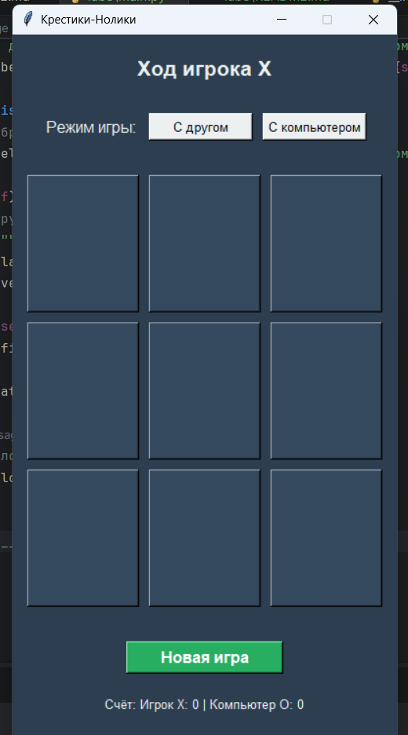
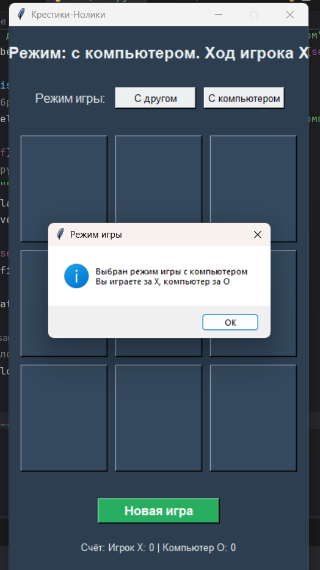
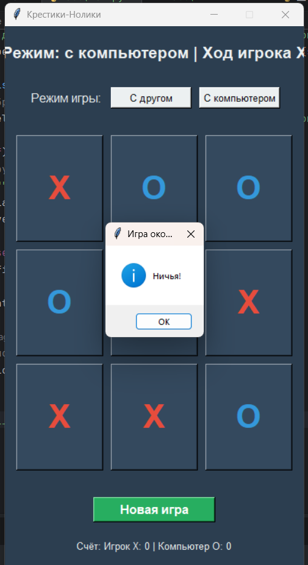

# Отчет
# Вариант 3
# Крестики-Нолики (Tic-Tac-Toe)
## Классическая игра "Крестики-Нолики" с графическим интерфейсом, двумя режимами игры и интеллектуальным противником.
# Описание:
## Это приложение представляет собой современную реализацию популярной логической игры "Крестики-Нолики" на поле 3×3.
## Код:
```` python
#импорт библиотек
import tkinter as tk
from tkinter import messagebox
import random

#создание класса игры
class TicTacToe:
    def __init__(self):
        self.root = tk.Tk()
        self.root.title("Крестики-Нолики")
        self.root.resizable(False, False)

        #игровые переменные
        self.current_player = "X"  # X начинает первым
        self.board = [""] * 9
        self.game_active = True
        self.vs_computer = False  # Режим игры: с компьютером или с другом

        #цветовая схема
        self.colors = {
            "bg": "#2C3E50",
            "board": "#34495E",
            "x_color": "#E74C3C",
            "o_color": "#3498DB",
            "btn_bg": "#ECF0F1",
            "text": "#ECF0F1"
        }

        #настройка главного окна
        self.root.configure(bg=self.colors["bg"])

        #создание интерфейса
        self.create_widgets()

        #центрирование окна
        self.center_window()

    def center_window(self):
        #центрирует окно на экране
        self.root.update_idletasks()
        #получаем реальный размер окна после размещения всех элементов
        width = self.root.winfo_reqwidth() + 20  #запрашиваемая ширина + запас
        height = self.root.winfo_reqheight() + 20  #запрашиваемая высота + запас
        x = (self.root.winfo_screenwidth() // 2) - (width // 2)
        y = (self.root.winfo_screenheight() // 2) - (height // 2)
        self.root.geometry(f'{width}x{height}+{x}+{y}')

    def create_widgets(self):
        #создает все виджеты интерфейса

        #верхняя панель с информацией
        self.info_frame = tk.Frame(self.root, bg=self.colors["bg"])
        self.info_frame.pack(pady=20)

        self.status_label = tk.Label(
            self.info_frame,
            text="Ход игрока X",
            font=("Arial", 16, "bold"),
            fg=self.colors["text"],
            bg=self.colors["bg"]
        )
        self.status_label.pack()

        #кнопки выбора режима
        self.mode_frame = tk.Frame(self.root, bg=self.colors["bg"])
        self.mode_frame.pack(pady=10)

        self.mode_label = tk.Label(
            self.mode_frame,
            text="Режим игры:",
            font=("Arial", 12),
            fg=self.colors["text"],
            bg=self.colors["bg"]
        )
        self.mode_label.pack(side=tk.LEFT, padx=5)

        self.friend_btn = tk.Button(
            self.mode_frame,
            text="С другом",
            font=("Arial", 10),
            command=self.set_friend_mode,
            bg=self.colors["btn_bg"],
            width=12
        )
        self.friend_btn.pack(side=tk.LEFT, padx=5)

        self.computer_btn = tk.Button(
            self.mode_frame,
            text="С компьютером",
            font=("Arial", 10),
            command=self.set_computer_mode,
            bg=self.colors["btn_bg"],
            width=12
        )
        self.computer_btn.pack(side=tk.LEFT, padx=5)

        #игровое поле 3x3
        self.board_frame = tk.Frame(self.root, bg=self.colors["bg"])
        self.board_frame.pack(pady=20)

        #создание кнопок игрового поля
        self.buttons = []
        for i in range(9):
            row = i // 3
            col = i % 3
            btn = tk.Button(
                self.board_frame,
                text="",
                font=("Arial", 32, "bold"),
                width=4,
                height=2,
                command=lambda idx=i: self.make_move(idx),
                bg=self.colors["board"],
                fg=self.colors["x_color"],
                activebackground=self.colors["board"]
            )
            btn.grid(row=row, column=col, padx=5, pady=5)
            self.buttons.append(btn)

        #кнопка сброса игры
        self.reset_btn = tk.Button(
            self.root,
            text="Новая игра",
            font=("Arial", 12, "bold"),
            command=self.reset_game,
            bg="#27AE60",
            fg="white",
            width=15,
            height=1
        )
        self.reset_btn.pack(pady=10)

        #статистика (для режима с компьютером)
        self.stats_frame = tk.Frame(self.root, bg=self.colors["bg"])
        self.stats_frame.pack(pady=10)

        self.score_label = tk.Label(
            self.stats_frame,
            text="Счёт: Игрок X: 0 | Компьютер O: 0",
            font=("Arial", 10),
            fg=self.colors["text"],
            bg=self.colors["bg"]
        )
        self.score_label.pack()

        self.score_x = 0
        self.score_o = 0

    def set_friend_mode(self):
        #Устанавливает режим игры с другом
        self.vs_computer = False
        self.reset_game()
        self.status_label.config(text="Режим: с другом. Ход игрока X")
        messagebox.showinfo("Режим игры", "Выбран режим игры с другом")

    def set_computer_mode(self):
        #Устанавливает режим игры с компьютером
        self.vs_computer = True
        self.reset_game()
        self.status_label.config(text="Режим: с компьютером. Ход игрока X")
        messagebox.showinfo("Режим игры", "Выбран режим игры с компьютером\nВы играете за X, компьютер за O")
    # как работает ход игрока
    def make_move(self, position):
        #Обрабатывает ход игрока
        if not self.game_active:
            return

        if self.board[position] != "":
            messagebox.showwarning("Неверный ход", "Эта клетка уже занята!")
            return

        #если режим с компьютером и сейчас ход компьютера (O) - не даём игроку ходить
        if self.vs_computer and self.current_player == "O":
            return

        #делаем ход
        self.board[position] = self.current_player
        self.buttons[position].config(
            text=self.current_player,
            fg=self.colors["x_color"] if self.current_player == "X" else self.colors["o_color"]
        )

        #проверяем победу
        if self.check_winner():
            self.handle_game_end(f"Игрок {self.current_player} победил!")
            if self.vs_computer:
                if self.current_player == "X":
                    self.score_x += 1
                else:
                    self.score_o += 1
                self.update_score_display()
            return

        #проверяем ничью
        if self.check_tie():
            self.handle_game_end("Ничья!")
            return

        #меняем игрока
        if self.current_player == "X":
            self.current_player = "O"
        else:
            self.current_player = "X"

        self.update_status()

        #ЕСЛИ РЕЖИМ С КОМПЬЮТЕРОМ И ТЕПЕРЬ ХОД КОМПЬЮТЕРА - ЗАПУСКАЕМ ЕГО
        if self.vs_computer and self.current_player == "O":
            self.root.after(500, self.computer_move)

    def computer_move(self):
        #ход компьютера
        if not self.game_active:
            return
        if self.current_player != "O":
            return

        #находим лучший ход
        best_move = self.get_best_move()

        if best_move is not None:
            #делаем ход компьютера
            self.board[best_move] = "O"
            self.buttons[best_move].config(
                text="O",
                fg=self.colors["o_color"]
            )

            #проверяем победу компьютера
            if self.check_winner():
                self.handle_game_end("Компьютер победил!")
                self.score_o += 1
                self.update_score_display()
                return

            #проверяем ничью
            if self.check_tie():
                self.handle_game_end("Ничья!")
                return

            #меняем игрока обратно на X
            self.current_player = "X"
            self.update_status()
    #стратегия компьютера
    def get_best_move(self):
        #находит лучший ход для компьютера
        #сначала проверяем, может ли компьютер выиграть
        for i in range(9):
            if self.board[i] == "":
                self.board[i] = "O"
                if self.check_winner_on_board():
                    self.board[i] = ""
                    return i
                self.board[i] = ""

        #затем блокируем победу игрока
        for i in range(9):
            if self.board[i] == "":
                self.board[i] = "X"
                if self.check_winner_on_board():
                    self.board[i] = ""
                    return i
                self.board[i] = ""

        #занимаем центр, если свободен
        if self.board[4] == "":
            return 4

        #занимаем углы
        corners = [0, 2, 6, 8]
        available_corners = [c for c in corners if self.board[c] == ""]
        if available_corners:
            return random.choice(available_corners)

        #занимаем любую свободную клетку
        available_moves = [i for i in range(9) if self.board[i] == ""]
        if available_moves:
            return random.choice(available_moves)

        return None

    def check_winner_on_board(self):
        #проверяет победу на текущей доске (без учета game_active)
        win_combinations = [
            [0, 1, 2], [3, 4, 5], [6, 7, 8],  #горизонтали
            [0, 3, 6], [1, 4, 7], [2, 5, 8],  #вертикали
            [0, 4, 8], [2, 4, 6]  #диагонали
        ]

        for combo in win_combinations:
            if (self.board[combo[0]] == self.board[combo[1]] == self.board[combo[2]] != ""):
                return True
        return False

    #проверка победы
    def check_winner(self):
        #проверяет наличие победителя
        win_combinations = [
            [0, 1, 2], [3, 4, 5], [6, 7, 8],
            [0, 3, 6], [1, 4, 7], [2, 5, 8],
            [0, 4, 8], [2, 4, 6]
        ]

        for combo in win_combinations:
            if (self.board[combo[0]] == self.board[combo[1]] == self.board[combo[2]] != ""):
                # Подсвечиваем выигрышную комбинацию
                for idx in combo:
                    self.buttons[idx].config(bg="#27AE60")
                return True
        return False

    def check_tie(self):
        #проверяет ничью
        return all(cell != "" for cell in self.board)

    def handle_game_end(self, message):
        #обрабатывает окончание игры
        self.game_active = False
        messagebox.showinfo("Игра окончена", message)
        self.status_label.config(text=message)

    def update_status(self):
        #обновляет статус игры
        mode_text = "с другом" if not self.vs_computer else "с компьютером"
        self.status_label.config(text=f"Режим: {mode_text} | Ход игрока {self.current_player}")

    def update_score_display(self):
        #обновляет отображение счёта
        self.score_label.config(text=f"Счёт: Игрок X: {self.score_x} | Компьютер O: {self.score_o}")

    def reset_game(self):
        #сбрасывает игру
        self.board = [""] * 9
        self.current_player = "X"
        self.game_active = True

        for button in self.buttons:
            button.config(text="", bg=self.colors["board"])

        self.update_status()

    def run(self):
        #запускает приложение
        self.root.mainloop()

#запуск игры
if __name__ == "__main__":
    game = TicTacToe()
    game.run()
````
## Результат программы:



## Возможности:
## Два режима игры:
1) С другом – два игрока по очереди делают ходы на одном устройстве 
2) С компьютером – соревнуйтесь с ИИ, который имеет базовую стратегию
## Визуальные особенности:
1) Современный тёмный интерфейс с цветовой индикацией
2) Подсветка выигрышной комбинации зелёным цветом 
3) Различные цвета для крестиков (красный) и ноликов (синий)
## Игровая механика:
1) Автоматическая проверка победителя и ничьей 
2) Ведение счёта в режиме игры с компьютером 
3) Защита от некорректных ходов 
4) Возможность начать новую партию в любой момент
## Технологии
### Python 3.6 или выше
### Tkinter – встроенная библиотека для создания графического интерфейса (не требует установки)
### Random – стандартная библиотека для случайных чисел
# Инструкция по запуску:
## Установка и запуск:
1) Скачайте файл main.py в отдельную папку
2) Откройте терминал и перейдите в папку с игрой:
## Пример:
`cd C:\Users\диана\PycharmProjects\python_lab_\lab8`
3) Запустите игру командой:
`python main.py`
## Примечания по установке Tkinter:
### Tkinter обычно входит в стандартную поставку Python. Если возникает ошибка `No module named 'tkinter'`, установите его:
1) Ubuntu/Debian:
`sudo apt-get install python3-tk`
2) Fedora:
`sudo dnf install python3-tkinter`
# Краткая справка:
## Управление:
1) Сделать ход -> Кликнуть левой кнопкой мыши по любой свободной клетке
2) Начать новую игру ->	Нажать кнопку "Новая игра"
3) Выбрать режим "С другом"	-> Нажать кнопку "С другом"
4) Выбрать режим "С компьютером" ->	Нажать кнопку "С компьютером"
## Правила игры:
1) Игра ведётся на поле размером 3×3 клетки
2) Игроки по очереди ставят свои знаки в свободные клетки:
#### X (крестики) – начинает первым
#### O (нолики) – ходит вторым
3) Цель игры: первым построить линию из трёх своих знаков:
#### По горизонтали (любая из 3 строк)
#### По вертикали (любой из 3 столбцов)
#### По диагонали (главная или побочная)
4) Если все 9 клеток заполнены, но никто не выстроил линию – объявляется ничья
## Особенности режимов:
## 1. Режим "С другом"
### Два игрока играют на одном устройстве
### Подходит для игры с друзьями или родственниками
### Счёт не ведётся
## 2. Режим "С компьютером"
### Вы играете за X (крестики)
### Компьютер играет за O (нолики)
### Ведётся счёт побед (обновляется автоматически)
### Компьютер имеет базовый ИИ (непростой, но обыгрываемый)